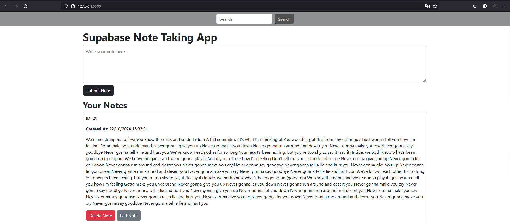

# Supabase Notes
Supabase Notes is a web-based application that allows users to create, manage, and store notes.

## Features
- **Real-time Database**: Instant synchronization of notes across devices.
- **CRUD Operations**: Create, Read, Update, and Delete notes.
- **Responsive Design**: Accessible on both desktop and mobile devices.

## Technologies Used

- **Frontend**:
  - HTML
  - CSS
    - Bootstrap Framework
  - JavaScript
- **Backend**:
  - Supabase

## Getting Started

Follow these steps to set up the project locally:

### 1. **Clone the Repository**:

   ```bash
   git clone https://github.com/ISE-S46/Supabase_Notes.git
   cd Supabase_Notes
   ```
### 2. **Set Up Supabase**:
- Sign up for a Supabase account.
- Create a new organization.
- Create a new project.
- Copy the Project URL and API keys.

### 3. **Create a config.js file**:
- Add your Supabase credentials:
    ```js
    const SUPABASE_URL = 'your-supabase-url';
    const SUPABASE_ANON_KEY = 'your-anonymous-key';
    ```
### 4. **Launch the Application**:
- Open index.html in your preferred web browser.
    #### Or
- Install live server extension on VSCode and click Go live button

